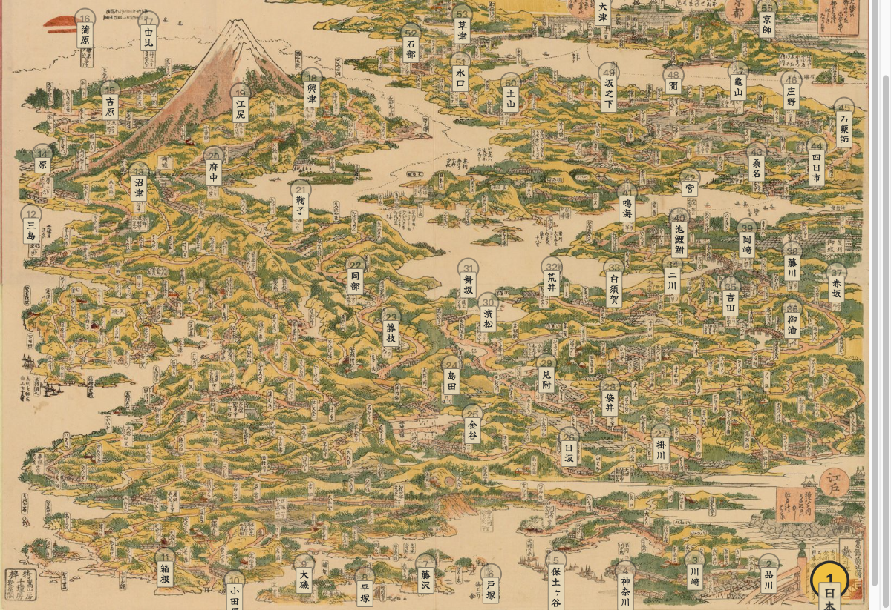
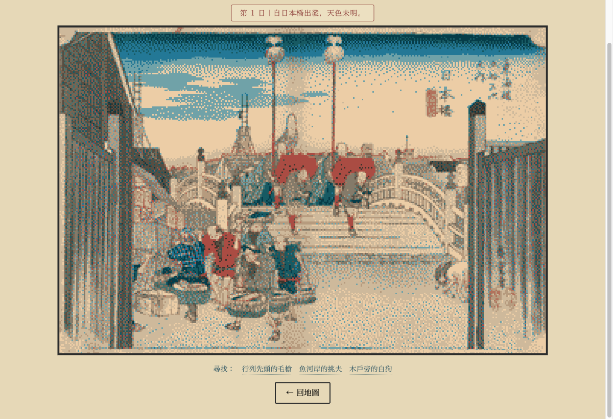
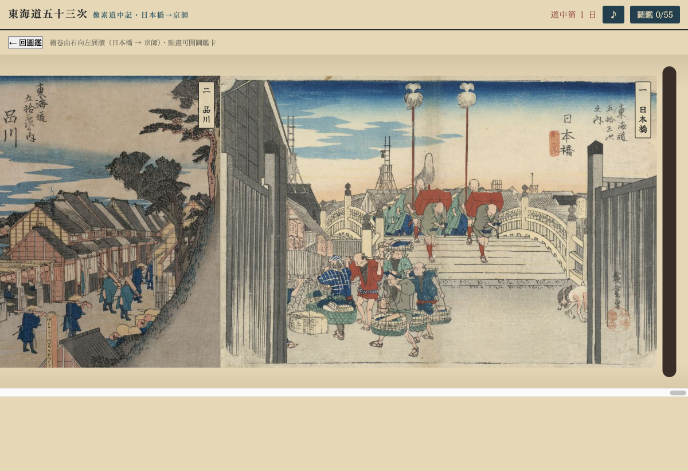
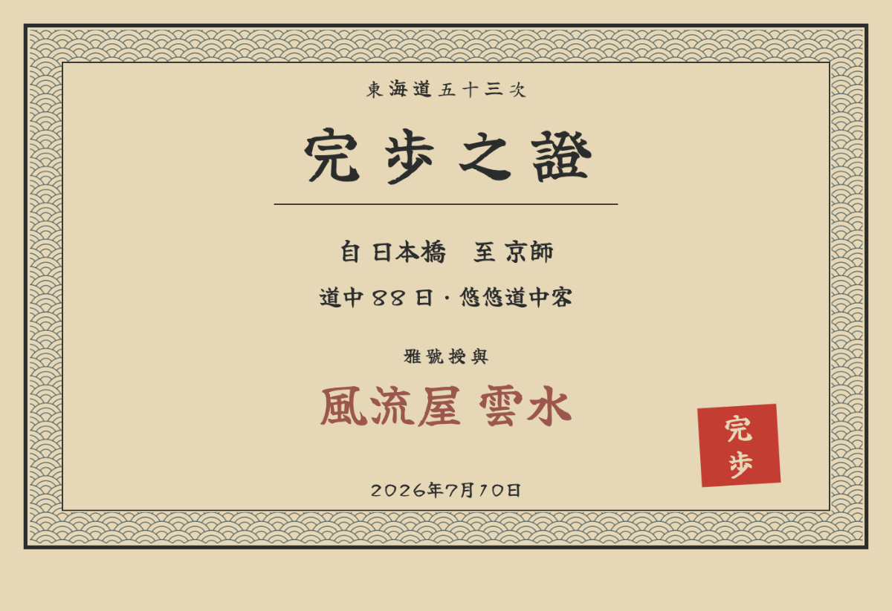

# Tōkaidō Pixel — 東海道五十三次・像素道中記

**Walk the 53 Stations of the Tōkaidō through Hiroshige's woodblock prints — a hidden-detail game in a single HTML file.**

You are a traveler leaving Edo's Nihonbashi bridge for Kyoto, station by station, across Hokusai's bird's-eye map *Famous Places on the Tōkaidō in One View* (c. 1818). At each station you step inside Hiroshige's *Fifty-Three Stations of the Tōkaidō* (Hōeidō edition, 1833–34) — rendered as a 14-color dithered pixel scene — and hunt for three details hidden in the print: a dog by the wooden gate, a kite cut loose in the wind, the last view of Mt. Fuji. Find them all and the original museum scan unlocks in full resolution.

No framework, no build step, no server logic. One `index.html`, public-domain art, and your browser.

|  |  |
|---|---|
|  |  |
| *Hokusai's bird's-eye map as the overworld — brush-lettered station labels, pulsing beacon on your current station* | *Find three details in each pixelated Hiroshige print* |
|  |  |
| *Emakimono mode: all 55 prints joined into one scroll, read right-to-left* | *Finish the road to earn a downloadable completion certificate* |

## Quick start

```bash
git clone https://github.com/<you>/tokaido-pixel.git
cd tokaido-pixel
python3 -m http.server 8791
# open http://localhost:8791
```

Any static file server works — the repo is also GitHub Pages-ready (Settings → Pages → deploy from branch).

## How to play

- **Tap the pulsing gold station** on the map to enter its print.
- **Find the three details** listed under the scene. Misses cost you nothing at first, but every travel day is counted — dawdling shows.
- Finding all three **unlocks the original artwork**: museum-quality scan, full-screen viewer with two-stage zoom.
- **“Next station →”** plays a travel animation across the map and moves you down the road.
- Reach Kyoto (station 55) and the **finale** begins: a replay of your whole journey across the map, pixel fireworks over Sanjō Ōhashi, and a traveler-name (*gagō*) bestowed according to how many days you took — from *swift-footed courier* to *dawdler supreme*.

## Features

- **All 55 stations** — Nihonbashi, the 53 post stations, and Keishi (Kyoto), each with 3 hand-placed find-the-detail puzzles (165 total, every one verified against the print)
- **Two renderings per print** — a 320px pixel scene quantized to a 14-color ukiyo-e palette with Floyd–Steinberg dithering, and the original scan (up to 2600px) for the collection
- **Hokusai overworld** — station nodes placed on the actual geography of the 1818 map, with vertical brush-script labels (embedded 61KB subset of the OFL font *Yuji Boku*)
- **Zukan (collection book)** — every unlocked print with description and provenance; flip pages with on-screen arrows or **← / → keys**
- **Emakimono mode** — after completion, all 55 originals join into one continuous handscroll with auto-play unrolling
- **Completion certificate** — canvas-drawn *kanpo-shō* with a seigaiha wave border, brush typography, vermillion seal, your days/rank/gagō, downloadable as PNG
- **Sound** — an original Web Audio chiptune (yō-scale pentatonic); optional support for rotating your own BGM tracks
- **Zero dependencies** — vanilla JS in one file, progress in `localStorage`, works offline once loaded

## The art

Every artwork is **public domain**, sourced from museum scans:

- **Scenes** — Utagawa Hiroshige, *Fifty-Three Stations of the Tōkaidō* (Hōeidō edition, c. 1833–34). Primary source: Library of Congress full-resolution scans, with Cleveland Museum of Art, MFA Boston, and Rijksmuseum filling gaps.
- **Overworld** — Katsushika Hokusai, *Famous Places on the Tōkaidō in One View* (東海道名所一覧, c. 1818).

Full per-image provenance (source page, license, scan notes) lives in [`assets/sources.json`](assets/sources.json).

The pixel scenes are generated by [`tools/make-station-assets.py`](tools/make-station-assets.py): crop the scan to the image block, resize to 320px, and quantize to the 14-color palette in `assets/palette.json`. The other tools in [`tools/`](tools/) handle Wikimedia Commons scan discovery and the red-circle detection used to map station coordinates onto Hokusai's map — the making-of work-logs are in [`phase-b/`](phase-b/).

## Music

Out of the box the game plays an **original Web Audio chiptune** (yō-scale pentatonic) — no third-party audio, nothing to license.

If you'd like richer background music, the game supports rotating through your own tracks. These three [DOVA-SYNDROME](https://dova-s.jp/) pieces fit the mood well (free BGM, commercial use OK, no credit required):

| Track | Page |
|---|---|
| 下町屋台で食べ歩き | [dova-s.jp/bgm/detail/10111](https://dova-s.jp/bgm/detail/10111) |
| のんびり旅風情 | [dova-s.jp/bgm/detail/9199](https://dova-s.jp/bgm/detail/9199) |
| 江戸のぶらり旅 | [dova-s.jp/bgm/detail/2652](https://dova-s.jp/bgm/detail/2652) |

DOVA-SYNDROME's licence permits **playing** the tracks in a work but forbids **redistributing the audio files themselves**, so they are deliberately **not bundled** in this repo. To enable them, download the mp3s from the pages above, drop them into `game-assets/bgm/`, and list the filenames in the `BGM_LIST` array in `index.html`.

## Tech notes

- **Single-file game**: all CSS, JS, and data (the 55-station `STATIONS` array with coordinates, puzzle points, and descriptions) live in `index.html` (~1,300 lines).
- **No hit-detection library**: taps are normalized to image coordinates and matched against detail points with an aspect-corrected radius.
- **Brush typography**: station names, the finale, and the certificate use *Yuji Boku* (SIL OFL 1.1), subset with `pyftsubset` from 8.1MB down to 61KB — exactly the 139 glyphs the game needs.
- **Certificate**: drawn at 1400×900 on a canvas — washi background, double ink rule, procedural seigaiha wave border, rotated seal — then exported via `toDataURL`.
- **Font/audio preloading**, beacon animations that don't perturb scroll geometry, and an autoplay-policy-safe BGM bootstrap are all handled in small, commented vanilla-JS blocks.

## License

- **Code**: MIT (see `LICENSE`).
- **Artwork**: public domain (see `assets/sources.json` for per-image provenance).
- **Music**: DOVA-SYNDROME free license — bundled with the game, not for standalone redistribution.
- **Font**: Yuji Boku © Kataoka Yuji, SIL Open Font License 1.1 (subset embedded).

---

*安全第一・道中無事 — safe travels on the road.*
