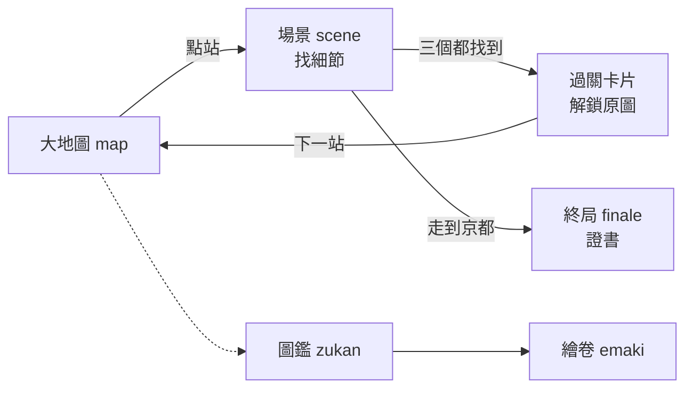

# 1 · 遊戲外殼（單檔 HTML）

整個遊戲活在一個 `index.html` 裡：`<style>` 是外觀、`<script>` 是邏輯、`STATIONS` 陣列是全部內容資料。這頁講**外殼**——視圖如何切換、狀態如何存、55 站資料長什麼樣。玩法規則（怎麼判命中、怎麼算天數）在 [2-gameplay](2-gameplay.md)。

檔案分區：CSS 從 `<style>` 起 〔`tokaido-pixel/index.html:20` · `<style>`〕、DOM 從 `<body>` 起 〔`tokaido-pixel/index.html:399` · `<body>`〕、JS 從 `<script>` 起 〔`tokaido-pixel/index.html:517` · `<script>`〕。

## 為誰存在 / 不做什麼

- **為誰**：讓一個沒有後端、沒有帳號系統的純前端遊戲，也能有「多個畫面 + 存進度」的完整體驗。
- **不做**：不做路由（沒有 URL router）、不做元件框架。視圖切換靠一個 `active` class，狀態靠一個全域物件。這是單檔遊戲能承受的最小機制。

## 概念 → 程式實體

| 概念 | 程式實體 | 說明 |
|---|---|---|
| 五個視圖共存於一頁 | DOM `id="map"` 等 〔`tokaido-pixel/index.html:413` · `
`〕 | map/scene/zukan/emaki/finale 都在 DOM，靠 class 顯隱 |
| 切視圖 | `show()` 〔`tokaido-pixel/index.html:999` · `function show(view)`〕 | 移除全部 `.active` 再給目標加上 |
| 全域狀態 | `state` 〔`tokaido-pixel/index.html:982` · `let state = load()`〕 | `{found, visited, days, log}` |
| 讀檔（含容錯） | `load()` 〔`tokaido-pixel/index.html:986` · `function load()`〕 | 解析失敗回預設初始 state |
| 寫檔 | `save()` 〔`tokaido-pixel/index.html:993` · `const save =`〕 | 每次命中/移動即寫 localStorage |
| 存檔 key（含版本） | `KEY` 〔`tokaido-pixel/index.html:981` · `const KEY = "tokaido-progress-v2"`〕 | `-v2` 是存檔格式版本 |
| 完成度衍生查詢 | `foundOf`/`isDone`/`doneCount` 〔`tokaido-pixel/index.html:996` · `const doneCount`〕 | 由 `state.found` 即時算，不另存 |
| 大地圖建節點 | `buildMap()` 〔`tokaido-pixel/index.html:1016` · `function buildMap`〕 | 依每站 `map:[x,y]` 擺 `.node` |
| 便捷選取器 | `$` 〔`tokaido-pixel/index.html:998` · `const $ = id =>`〕 | `document.getElementById` 別名 |

## 55 站資料模型：`STATIONS`

這是全遊戲的內容真相。一個陣列，55 個物件，每個物件是一站。〔`tokaido-pixel/index.html:519` · `const STATIONS = [`〕

一站的欄位（以日本橋為例）：

| 欄位 | 型別 | 意義 |
|---|---|---|
| `slug` | string | 資產檔名前綴，如 `01-nihonbashi`，對應 `game-assets/*/01-nihonbashi.*` |
| `ja` | string | 宿名（日文），如「日本橋」 |
| `pic` | string | 畫題，如「朝之景」 |
| `map` | `[x,y]` | 大地圖上的正規化座標（0–1），`buildMap()` 用它擺節點 |
| `details` | `[[x,y,name],…]` | **三個**找細節點：正規化座標 + 名稱，命中判定的靶心 |
| `desc` | string | 一兩句場景解說 |
| `facts` | string[] | 卡片裡的歷史小知識 |
| `credit` | string | 掃描來源與授權 |

〔`tokaido-pixel/index.html:520` · `slug:"01-nihonbashi"`〕

**為什麼座標用 0–1 正規化**：同一組 `details` 座標要同時對得上像素場景圖（320px）和原圖（最大 2600px）——存絕對像素就會綁死某個尺寸。正規化後，命中判定只需把點擊位置也正規化再比對即可（見 [2-gameplay](2-gameplay.md) 的 aspect 校正）。

## 視圖流轉

流轉的軸心是 `show(view)`：它不銷毀任何 DOM，只切 `active` class；因此各視圖狀態（捲動位置、已建節點）都保留著。〔`tokaido-pixel/index.html:999` · `function show(view)`〕

## 已知的坑

- **存檔版本**：`KEY` 尾碼 `-v2` 意味著存檔格式曾改版。改動 `state` 結構時要考慮舊存檔——`load()` 已對解析失敗做容錯回預設。〔`tokaido-pixel/index.html:986` · `function load()`〕
- **視圖不銷毀**的取捨：省了重建成本，但代表若某視圖 build 過一次就不會自動反映後來的 state 變化，需要的地方會顯式重 build（如 `buildZukan()`/`buildMap()` 在返回時再呼叫一次）。
