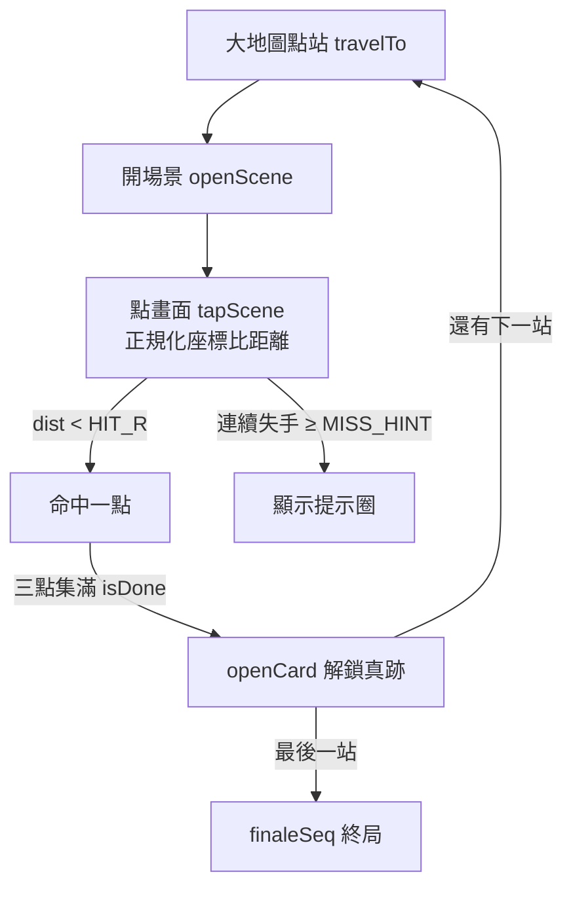

# 2 · 玩法核心

外殼（視圖、狀態、55 站資料）在 [1-game-shell](1-game-shell.md)。這頁講**規則**：走進一幅畫怎麼找細節、怎麼判命中、旅程天數怎麼加、全找齊後怎麼收尾（卡片→圖鑑→繪卷→證書）。

## 一條主玩法迴圈

## 找細節：命中判定

核心在 `tapScene(nx, ny)`——參數是**已正規化**（0–1）的點擊座標。〔`tokaido-pixel/index.html:1110` · `function tapScene`〕

判定邏輯：對該站每個尚未找到的 `details` 點，算點擊到它的距離，小於 `HIT_R` 就算命中。

| 元素 | 程式實體 | 說明 |
|---|---|---|
| 命中半徑 | `HIT_R = 0.075` 〔`tokaido-pixel/index.html:978` · `const HIT_R = 0.075`〕 | 相對場景寬的比例，故不綁死解析度 |
| **aspect 校正** | `aspect` 〔`tokaido-pixel/index.html:1115` · `const aspect =`〕 | y 差乘上高寬比，讓「圓」在非正方畫面裡仍是圓 |
| 距離公式 | `Math.hypot` 〔`tokaido-pixel/index.html:1120` · `const dist = Math.hypot`〕 | `hypot(nx-x, (ny-y)*aspect)` |
| 已過關＝展示模式 | `if (isDone(s)) return false` 〔`tokaido-pixel/index.html:1112` · `過關站是展示模式`〕 | 找齊後點畫不再判定，純欣賞 |
| 失手提示 | `MISS_HINT = 3` 〔`tokaido-pixel/index.html:979` · `const MISS_HINT = 3`〕 | 連錯 3 次亮出提示圈 〔`tokaido-pixel/index.html:1140` · `if (++misses >= MISS_HINT)`〕 |

**為什麼要 aspect 校正**：`details` 座標是相對圖片寬高的 0–1 值。若不乘高寬比，一個「半徑 0.075 的圓」在寬扁的浮世繪上會被壓成橢圓——玩家覺得上下方向特別難點中。乘上 `naturalHeight/naturalWidth` 把 y 軸換算回同一尺度，命中區才是真正的圓。〔`tokaido-pixel/index.html:1115` · `img.naturalHeight / img.naturalWidth`〕

命中後：記進 `state.found`，若該站三點集滿（`isDone`），延遲 900ms 自動開過關卡片。〔`tokaido-pixel/index.html:1128` · `openCard(current, true)`〕

## 完成度的三個衍生查詢

不另存欄位，全部由 `state.found` 即時算出：

| 查詢 | 定義 |
|---|---|
| `foundOf(s)` | 某站已找到的點清單 〔`tokaido-pixel/index.html:994` · `const foundOf =`〕 |
| `isDone(s)` | 已找數 == 該站 details 數 〔`tokaido-pixel/index.html:995` · `const isDone =`〕 |
| `doneCount()` | 全 55 站中已完成幾站 〔`tokaido-pixel/index.html:996` · `const doneCount`〕 |

`isDone` 是全遊戲的閘門：下一站是否可達（`buildMap` 裡 `reachable`）、圖鑑是否亮、繪卷是否解鎖、終局是否觸發，全看它。

## 旅程天數與隨機事件

移動到新站時 `travelTo(i)` 除了記錄已訪，還會**推進旅程天數**並抽一則路上見聞。〔`tokaido-pixel/index.html:1040` · `function travelTo`〕

機制：`EVENTS` 是 `[權重, 額外天數, 文字]` 的清單〔`tokaido-pixel/index.html:969` · `const EVENTS = [`〕。`travelTo` 把每則事件按權重展開成池子再隨機抽一則，`state.days` 加上「1 + 額外天數」，並把見聞寫進 `state.log`。〔`tokaido-pixel/index.html:1046` · `EVENTS.forEach`〕

> 這是純風味系統：天數/事件只影響 HUD 顯示與氣氛，不影響能否過關。

## 收尾三態：卡片 → 圖鑑 → 繪卷

| 模式 | 入口 | 作用 |
|---|---|---|
| **過關卡片** | `openCard(i)` 〔`tokaido-pixel/index.html:1213` · `function openCard`〕 | 展示博物館真跡 + `facts` 歷史小知識，可翻到下一張 |
| **圖鑑 zukan** | `buildZukan()` 〔`tokaido-pixel/index.html:1502` · `function buildZukan`〕 | 55 站縮圖總覽；全完成後才亮「繪卷」按鈕 〔`tokaido-pixel/index.html:1515` · `STATIONS.every(isDone)`〕 |
| **繪卷 emaki** | `buildEmaki()` 〔`tokaido-pixel/index.html:1523` · `function buildEmaki`〕 | 55 圖接成一條橫卷，右→左自動展（仿真實繪卷閱讀方向） |

繪卷的「自動展卷」是等速捲動，捲到卷尾被夾住即自停：`emakiPlay(on)` 用 `requestAnimationFrame` 每幀移動約 70px/s，偵測 `scrollLeft` 不再變化就停。〔`tokaido-pixel/index.html:1544` · `function emakiPlay`〕

## 終局與完歩證書

走到最後一站（京師）過關，觸發終局序列 `finaleSeq()`：放煙火、彈出完歩證卡片。〔`tokaido-pixel/index.html:1354` · `function finaleSeq`〕

證書由 `drawCert()` 用 canvas 即時繪製——**寛政(kanpo)風的官牒樣式**，青海波紋邊框、直書漢數字，可下載成 PNG。〔`tokaido-pixel/index.html:1442` · `async function drawCert`〕。下載綁在 `finale-dl` 按鈕。〔`tokaido-pixel/index.html:1494` · `finale-dl`〕

## 已知的坑

- **命中半徑是全域常數**：所有站共用 `HIT_R=0.075`。若某幅畫的細節特別小或彼此靠近，可能誤觸相鄰點——目前無 per-station 微調。
- **事件系統與存檔**：`state.days`/`state.log` 存進 localStorage；若 `EVENTS` 文案改版，舊存檔的 `log` 仍是舊文字（不會回填）。
