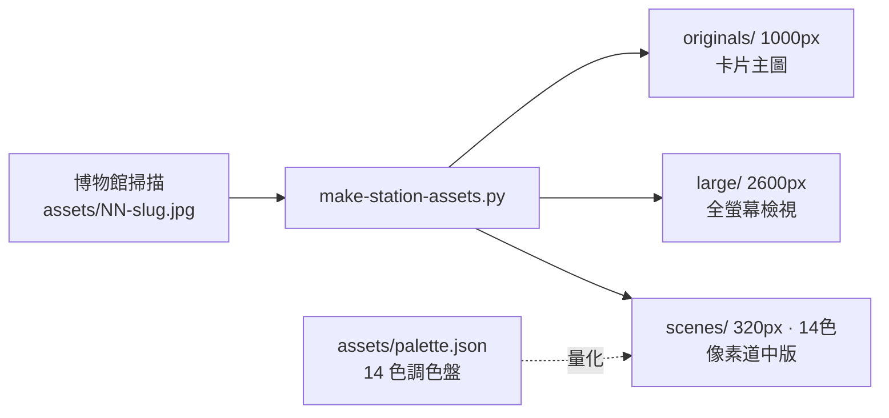

# 3 · Python 資產管線（tools/）

遊戲本體是純前端單檔（見 [1-game-shell](1-game-shell.md)），但畫面上那 55 幅浮世繪不是手工存的——它們由 `tools/` 底下四支 Python 腳本，從博物館掃描原圖**離線批次**產出。這頁講這條管線各段做什麼、為什麼這樣切。

> 這些腳本是**建置期工具**，不隨遊戲執行；產物 commit 進 repo 後，`index.html` 只是靜態引用它們。斷網沙盒裡除 `find-scans.py`（要打 Commons API）外都可跑，前提是有 Pillow/numpy。

## 一張掃描如何變成三種資產

## make-station-assets.py — 三尺寸產出 + 像素量化

一張來源圖一次產三檔，職責見 docstring。〔`tokaido-pixel/tools/make-station-assets.py:2` · `從博物館掃描產出單站三種遊戲資產`〕

| 產物 | 尺寸/處理 | 用途 | 程式 |
|---|---|---|---|
| `originals/{slug}.jpg` | 1000px 寬, q85 | 過關卡片主圖 | 〔`tokaido-pixel/tools/make-station-assets.py:47` · `min(1000, im.width)`〕 |
| `large/{slug}.jpg` | 2600px 寬, q78 | 全螢幕真跡檢視 | 〔`tokaido-pixel/tools/make-station-assets.py:48` · `min(2600, im.width)`〕 |
| `scenes/{slug}.png` | 320px, **14 色量化** | 像素風可點擊場景 | 〔`tokaido-pixel/tools/make-station-assets.py:49` · `quantize(resize_w(320))`〕 |

兩個關鍵設計取捨：

- **不超採樣**：`min(1000, im.width)` / `min(2600, ...)` 保證來源多小就多大，絕不放大一張本來就模糊的掃描去假裝高解析。〔`tokaido-pixel/tools/make-station-assets.py:48` · `不超采樣，來源多小就多大`〕
- **固定調色盤量化**：`scenes` 用專案共用的 14 色盤 + Floyd–Steinberg 誤差擴散做量化，讓 55 站的像素版風格一致。〔`tokaido-pixel/tools/make-station-assets.py:25` · `dither=Image.Dither.FLOYDSTEINBERG`〕 調色盤來自 `assets/palette.json`。〔`tokaido-pixel/tools/make-station-assets.py:17` · `assets/palette.json`〕

去紙邊：`--crop L,T,R,B` 以比例裁掉四邊白紙，只留畫芯。〔`tokaido-pixel/tools/make-station-assets.py:39` · `im.crop`〕

## detect-ref-circles.py — 從總圖偵測 53 宿紅圈

大地圖上 53 個宿場節點的座標，來源是一張標了紅圈的總覽參考圖。這支腳本用**顏色遮罩 + 群聚**把紅圈位置抓出來，產成待人工指認編號的座標表。職責見 docstring。〔`tokaido-pixel/tools/detect-ref-circles.py:2` · `偵測 53 宿的紅圈標註位置`〕

管線分三步：

| 步驟 | 手法 | 程式 |
|---|---|---|
| ① 抽紅色像素 | RGB 遮罩：紅高、且比綠藍高一截 | 〔`tokaido-pixel/tools/detect-ref-circles.py:24` · `mask = (r > 195)`〕 |
| ② 群聚成圈 | 18px 內的紅點歸為同一圈、算加權中心 | 〔`tokaido-pixel/tools/detect-ref-circles.py:31` · `abs(c[0] - x) < 18`〕 |
| ③ 面積濾雜點 | 只留像素數 60–800 的群（濾掉太陽/印章） | 〔`tokaido-pixel/tools/detect-ref-circles.py:40` · `60 < c[2] < 800`〕 |

輸出兩份：`circles.json`（正規化座標，`number` 欄留空待指認）+ `circle-tiles/`（每圈放大切片含下方名籤，供人逐一填編號）。〔`tokaido-pixel/tools/detect-ref-circles.py:54` · `circles.json`〕

> **半自動流程**：機器抓位置、人填編號。指認後把編號回填 `circles.json` 的 `number`，才成為節點座標的真相來源。〔`tokaido-pixel/tools/detect-ref-circles.py:8` · `指認後把編號填回`〕

## find-scans.py — 為待補宿場搜 Commons 掃描候選

Phase B 要把站數擴充到更多宿場（見 [4-build-log-phaseb](4-build-log-phaseb.md)）。這支對 `manifest.json` 裡 `status=todo` 的站，去 Wikimedia Commons 批量搜掃描候選。職責見 docstring。〔`tokaido-pixel/tools/find-scans.py:2` · `搜尋 Wikimedia Commons 掃描候選`〕

- 輸出 `phase-b/scan-candidates.json`：每站前幾名候選（標題/尺寸/授權/直連 URL），供人工挑選下載。
- 優先序：**LOC 全解析 LCCN 掃描 > 博物館 CC0/PD 大圖**。〔`tokaido-pixel/tools/find-scans.py:4` · `LOC 全解析 LCCN 掃描`〕
- 唯一要連外網的腳本（打 Commons API）。〔`tokaido-pixel/tools/find-scans.py:14` · `commons.wikimedia.org`〕

## make-icons.py — PWA/主畫面圖示

產 `icon-192.png` / `icon-512.png` 兩張主畫面圖示。〔`tokaido-pixel/tools/make-icons.py:2` · `game-assets/icon-192.png`〕

存在的理由寫在 docstring 裡很直白：**iPhone Safari 沒有 Fullscreen API**，手機要全螢幕只能靠「加到主畫面」，而那需要 manifest + icon。〔`tokaido-pixel/tools/make-icons.py:4` · `沒有 Fullscreen API`〕

兩個像素級細節：

- **4 倍超採樣再縮**：直接畫的圓在 192px 下邊緣會有階梯，故先大 4 倍畫圓再縮回。〔`tokaido-pixel/tools/make-icons.py:29` · `4 倍超取樣`〕
- **不自己切圓角**：Android(maskable)/iOS 會各自套遮罩，自己先切只會在外緣留鋸齒；故底色滿版、金點縮在中心 80% 安全區內。〔`tokaido-pixel/tools/make-icons.py:34` · `d.ellipse`〕

## 這條管線的邊界

- **腳本不管站的「內容」**：`details`（要找的細節點）、`facts`（歷史小知識）、`desc`/`credit` 全是人工在 `index.html` 的 `STATIONS` 裡填的，管線只負責影像資產。
- **依賴 Pillow / numpy**：斷網沙盒預設可能沒有；要跑得先確認環境（見 AGENTS.md 沙盒說明）。
- **產物已 commit**：日常玩遊戲不需重跑管線；只有新增/替換宿場圖時才會動到。
