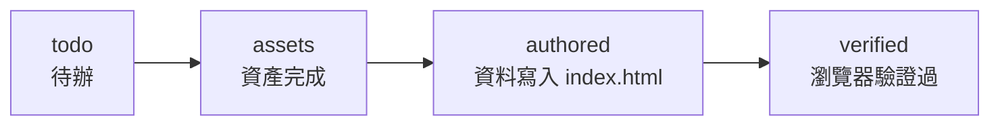

# 4 · Phase B 建置流程與資料契約

前三頁講的是**成品怎麼運作**。這頁講的是**這 55 站是怎麼被一站一站蓋出來的**——一套人＋工具＋agent 協作的擴充流程，以及維繫它的兩份資料契約。

> Phase A 手工做了前 15 站並驗證流程；Phase B 是把「蒲原→京師」剩下的 40 站批量擴充（遊戲編號 16–55）。〔`tokaido-pixel/phase-b/PHASE-B.md:1` · `蒲原→京師 40 站批量擴充`〕

## manifest.json — 唯一的進度真相

`phase-b/manifest.json` 是這條流程的**單一真相來源（single source of truth）**：40 站各自的 slug／宿名／畫題／狀態，每完成一站就更新它。〔`tokaido-pixel/phase-b/PHASE-B.md:9` · `這是唯一的進度真相來源`〕

每站是一筆記錄，欄位：

| 欄位 | 意義 | 範例 |
|---|---|---|
| `n` | 遊戲編號（宿場番號 + 1） | `16` 〔`tokaido-pixel/phase-b/manifest.json:5` · `"n": 16`〕 |
| `slug` | 資產檔名前綴 | `16-kanbara` 〔`tokaido-pixel/phase-b/manifest.json:6` · `"slug": "16-kanbara"`〕 |
| `ja` / `pic` | 宿名 / 該站採用的畫題 | 蒲原 / 夜之雪 〔`tokaido-pixel/phase-b/manifest.json:8` · `"pic": "夜之雪"`〕 |
| `status` | 四態狀態流 | `verified` 〔`tokaido-pixel/phase-b/manifest.json:9` · `"status": "verified"`〕 |

### 狀態流：四個閘門

〔`tokaido-pixel/phase-b/PHASE-B.md:8` · `todo → assets`〕。狀態單向推進，每過一關才改 manifest——這讓「做到哪」永遠有一個不靠記憶的答案。

> **目前進度**：manifest 內 40 站**全部 `verified`**（Phase B 已完成）。manifest 註解記錄了範圍定義。〔`tokaido-pixel/phase-b/manifest.json:2` · `剩餘 40 站`〕

## 單站五道工序

每站走一條 Phase A 驗證過的固定流程，把一個 `todo` 推到 `verified`：

| 工序 | 做什麼 | 對應工具/檔案 |
|---|---|---|
| ① 選圖 | 搜 Commons 掃描候選、挑圖、記溯源 | `find-scans.py` → `scan-candidates.json` → `assets/sources.json` |
| ② 產資產 | 三尺寸 + 像素量化 | `make-station-assets.py`（見 [3-asset-pipeline](3-asset-pipeline.md)） |
| ③ 大地圖座標 | 從紅圈總圖取節點 x,y | `circles.json` / `circle-tiles/` |
| ④ 遊戲內容 | 挑 3 個細節點、寫 desc/facts，append 進 `STATIONS` | `index.html`（見 [1-game-shell](1-game-shell.md)） |
| ⑤ 驗證 | Playwright 跑節點數/資產 200/命中回 true | `http.server` + Playwright |

### ① 選圖的關鍵陷阱：畫題必須對得上

同一個宿場，Commons 上常混著**不同浮世繪師的別系列**。務必核對畫題與 manifest 的 `pic` 欄一致。〔`tokaido-pixel/phase-b/PHASE-B.md:19` · `務必核對畫題與 manifest`〕

> Phase A 踩過的實例：`Numazu LCCN2009615349` 其實是**北齋的沼津，不是廣重保永堂版**。〔`tokaido-pixel/phase-b/PHASE-B.md:20` · `是北齋的沼津`〕 拿不準就先抓 500px 縮圖目視。

選圖優先序與資產產出、命中座標的規格，都與前面幾頁一致（LOC 全解析 > 博物館 CC0；命中半徑 0.075）。

### ③ 座標：紅圈 + 一個手工例外

節點座標來自 `detect-ref-circles.py` 產的 `circles.json`（見 [3-asset-pipeline](3-asset-pipeline.md)）；遊戲編號 = 宿場番號 + 1（日本橋為 1）。〔`tokaido-pixel/phase-b/PHASE-B.md:36` · `遊戲編號 = 宿場番號 + 1`〕

**唯一例外是終點京師**：參照總圖只標 53 宿、沒有京師的紅圈，故它的座標是人工在地圖右上「京都」朱印旁目測放的。〔`tokaido-pixel/phase-b/PHASE-B.md:37` · `終點 55-kyoto（京師）沒有紅圈`〕

### ⑤ 驗證：Playwright 三查

起 `python3 -m http.server 8791`，用 Playwright 對每站確認：節點總數 == STATIONS 數、三個資產檔 HEAD 全 200、`tapScene` 打三個細節座標全回 `true`。〔`tokaido-pixel/phase-b/PHASE-B.md:47` · `Playwright`〕 三查都過才把 status 標 `verified`。

## Phase B 的兩份資料契約

這條流程之所以能人／agent 交替接手不亂，靠兩份契約鎖住狀態：

| 契約 | 檔案 | 鎖住什麼 |
|---|---|---|
| **進度契約** | `manifest.json` | 每站走到四態的哪一態——避免重工/漏站 |
| **座標契約** | `circles.json` | 53 宿節點的正規化座標 + 待指認的 `number`——避免座標各寫各的 |

外加 `assets/sources.json` 記每張圖的溯源（授權/出處），讓成品可追。

## 給接手者的注意事項

- **改 manifest 前先看狀態**：狀態流是單向的，別把 `verified` 退回去，除非真的要重做該站。
- **畫題核對是硬規則**：跳過這步最容易埋下「掛錯畫」的髒資料，且事後很難察覺。
- **京師座標是手放的**：若之後換了地圖底圖，京師節點要重新目視對位，不能靠 `circles.json`。
